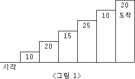
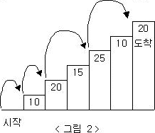

# 2020. 01. 13 Dynamic programming 문제 리스트

<br>

## 문제 1. [피보나치 함수 #1003](https://www.acmicpc.net/problem/1003)

### 문제

다음 소스는 N번째 피보나치 수를 구하는 C++ 함수이다.

```cpp
int fibonacci(int n) {
    if (n == 0) {
        printf("0");
        return 0;
    } else if (n == 1) {
        printf("1");
        return 1;
    } else {
        return fibonacci(n‐1) + fibonacci(n‐2);
    }
}
```

fibonacci(3)을 호출하면 다음과 같은 일이 일어난다.

- fibonacci(3)은 fibonacci(2)와 fibonacci(1) (첫 번째 호출)을 호출한다.

- fibonacci(2)는 fibonacci(1) (두 번째 호출)과 fibonacci(0)을 호출한다.

- 두 번째 호출한 fibonacci(1)은 1을 출력하고 1을 리턴한다.

- fibonacci(0)은 0을 출력하고, 0을 리턴한다.

- fibonacci(2)는 fibonacci(1)과 fibonacci(0)의 결과를 얻고, 1을 리턴한다.

- 첫 번째 호출한 fibonacci(1)은 1을 출력하고, 1을 리턴한다.

- fibonacci(3)은 fibonacci(2)와 fibonacci(1)의 결과를 얻고, 2를 리턴한다.

1은 2번 출력되고, 0은 1번 출력된다. N이 주어졌을 때, fibonacci(N)을 호출했을 때, 0과 1이 각각 몇 번 출력되는지 구하는 프로그램을 작성하시오.

### 입력

첫째 줄에 테스트 케이스의 개수 T가 주어진다.

각 테스트 케이스는 한 줄로 이루어져 있고, N이 주어진다. N은 40보다 작거나 같은 자연수 또는 0이다.

### 출력

각 테스트 케이스마다 0이 출력되는 횟수와 1이 출력되는 횟수를 공백으로 구분해서 출력한다.

### 알고리즘 분류

- 다이나믹 프로그래밍

### 문제 풀이

- [lxxjn0](./prob_1003/lxxjn0_prob_1003.cpp)
- [Jeongfeel](#)
- [minmin20028](#)
- [sin222](#)

<br>

## 문제 2. [계단 오르기 #2579](https://www.acmicpc.net/problem/2579)

### 문제

계단 오르기 게임은 계단 아래 시작점부터 계단 꼭대기에 위치한 도착점까지 가는 게임이다. <그림 1>과 같이 각각의 계단에는 일정한 점수가 쓰여 있는데 계단을 밟으면 그 계단에 쓰여 있는 점수를 얻게 된다.



예를 들어 <그림 2>와 같이 시작점에서부터 첫 번째, 두 번째, 네 번째, 여섯 번째 계단을 밟아 도착점에 도달하면 총 점수는 10 + 20 + 25 + 20 = 75점이 된다.



계단 오르는 데는 다음과 같은 규칙이 있다.

1. 계단은 한 번에 한 계단씩 또는 두 계단씩 오를 수 있다. 즉, 한 계단을 밟으면서 이어서 다음 계단이나, 다음 다음 계단으로 오를 수 있다.

2. 연속된 세 개의 계단을 모두 밟아서는 안 된다. 단, 시작점은 계단에 포함되지 않는다.

3. 마지막 도착 계단은 반드시 밟아야 한다.

따라서 첫 번째 계단을 밟고 이어 두 번째 계단이나, 세 번째 계단으로 오를 수 있다. 하지만, 첫 번째 계단을 밟고 이어 네 번째 계단으로 올라가거나, 첫 번째, 두 번째, 세 번째 계단을 연속해서 모두 밟을 수는 없다.

각 계단에 쓰여 있는 점수가 주어질 때 이 게임에서 얻을 수 있는 총 점수의 최댓값을 구하는 프로그램을 작성하시오.

### 입력

입력의 첫째 줄에 계단의 개수가 주어진다.

둘째 줄부터 한 줄에 하나씩 제일 아래에 놓인 계단부터 순서대로 각 계단에 쓰여 있는 점수가 주어진다. 계단의 개수는 300이하의 자연수이고, 계단에 쓰여 있는 점수는 10,000이하의 자연수이다.

### 출력

첫째 줄에 계단 오르기 게임에서 얻을 수 있는 총 점수의 최댓값을 출력한다.

### 알고리즘 분류

- 다이나믹 프로그래밍

### 문제 풀이

- [lxxjn0](./prob_2579/lxxjn0_prob_2579.cpp)
- [Jeongfeel](#)
- [minmin20028](#)
- [sin222](#)
